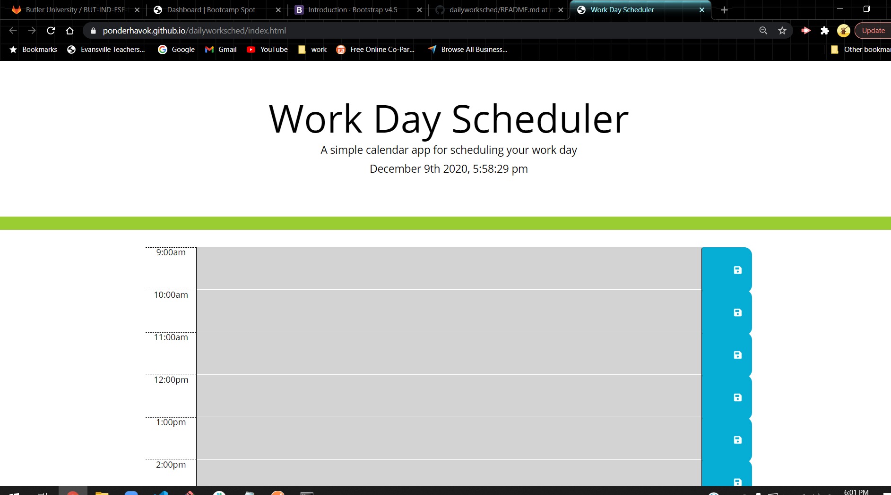

# dailyworksched

This **Daily Work Schedule** is a simple and basic application designed to aid in keeping your employees work schedule easy to understand and organized. 

It **updates automatically** through out the day between the working hours of 9 a.m to 5 p.m.

Simply type in the information you want stored and click on the save Icon to the right. **Simple**

Check it out for yourself at https://ponderhavok.github.io/dailyworksched/
